# Architecture

> Unified architecture document for **acp-openai-proxy** — a dependency-light Node.js proxy that exposes OpenAI-compatible HTTP endpoints and routes all generation to Agent Client Protocol (ACP) agents running as local subprocesses.

This document consolidates the former `CURRENT_VERSION_SPEC.md`, `ROUTING_DECISION.md`, `ROUTING_RESEARCH.md`, and `UPLOADED_SPEC_REVIEW.md` into a single reference.

---

## 1  System Context

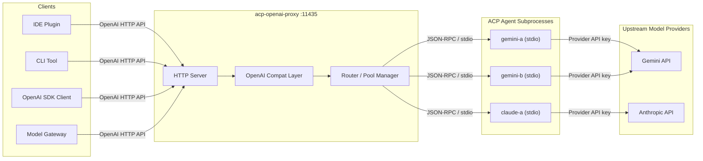

The proxy never calls model providers directly. Provider API keys belong to the configured ACP agent subprocesses. The primary use case is running local ACP-capable coding agents behind clients that already speak the OpenAI HTTP API.

---

## 2  Design Constraints

**Required properties:**

- Launch ACP agents as long-running local subprocesses communicating over stdin/stdout JSON-RPC.
- Expose standard OpenAI-compatible endpoints (`/v1/chat/completions`, `/v1/completions`, `/v1/responses`, `/v1/models`).
- Support multiple ACP subprocesses behind the same OpenAI model id (agent pools).
- Provide bounded routing failover when a runtime fails before producing visible output.
- Forward multimodal input only when the agent advertises the required capability.
- Support Chat Completions client-side function tools as a compatibility layer (no proxy-side execution).
- Keep all runtime state in memory. Zero runtime npm dependencies.

**Explicit non-goals:** no database, no dashboard, no queue broker, no hot-reload, no provider plugin registry, no remote file downloader, no proxy-side tool execution, no provider cost accounting, no session resume after crash.

---

## 3  Component Architecture

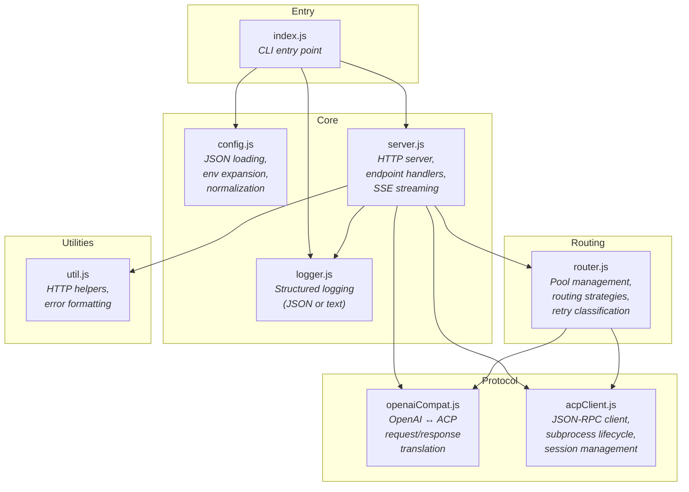

### Module responsibilities

| Module | Purpose |
|--------|---------|
| `index.js` | CLI arg parsing, config loading, server bootstrap, graceful shutdown |
| `config.js` | JSON config parsing, `{var:NAME}` / `${NAME}` env expansion, schema normalization |
| `logger.js` | Severity-filtered structured logging (stdout for debug/info, stderr for warn/error) |
| `server.js` | HTTP request routing, auth, endpoint handlers, SSE streaming, failover orchestration |
| `openaiCompat.js` | Prompt builders (chat/completion/responses → ACP blocks), response builders, tool-call extraction, routing key derivation |
| `acpClient.js` | `AcpConnection` (spawn, JSON-RPC, notifications), `AgentRuntime` (mutex, health tracking, `streamPrompt` async generator) |
| `router.js` | `AgentPool` (attempt ordering per strategy), `isRetryableError`, cooldown/backoff logic |
| `util.js` | `readJsonBody`, `jsonResponse`, `openAiError`, `compactError` |

### Dependency graph (leaf modules have no src/ imports)

```
index.js → config.js, logger.js, server.js
server.js → acpClient.js, logger.js, openaiCompat.js, router.js, util.js
router.js → acpClient.js, openaiCompat.js
Leaf: config.js, logger.js, util.js, acpClient.js, openaiCompat.js
```


---

## 4  Request Lifecycle

### 4.1  Non-streaming request

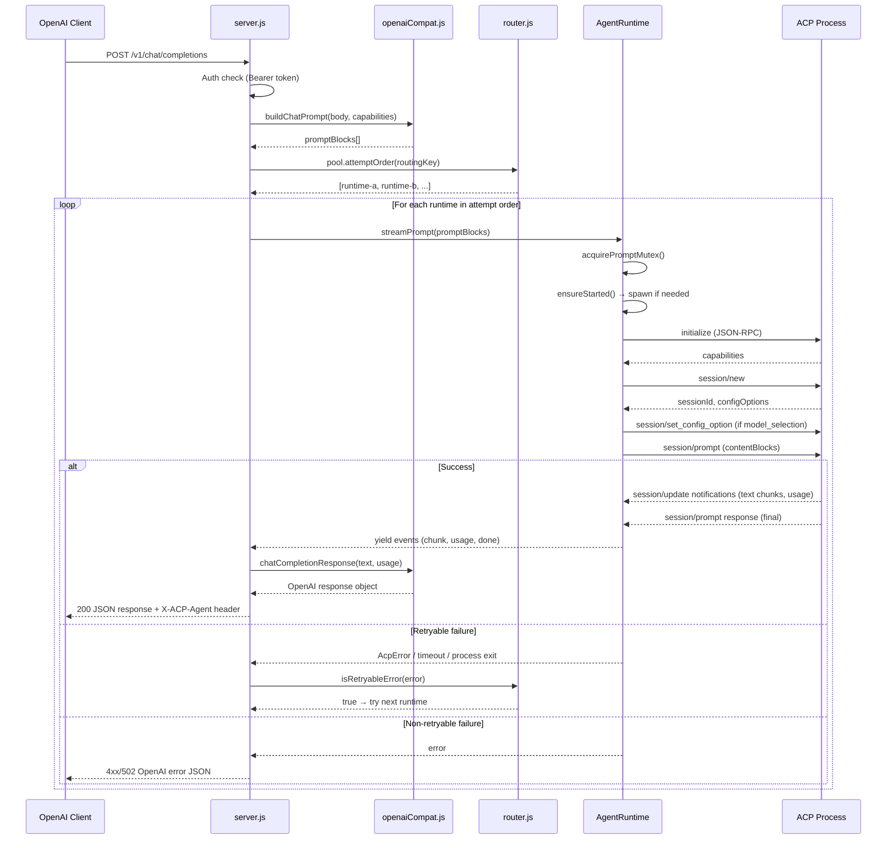

### 4.2  Streaming request (SSE)

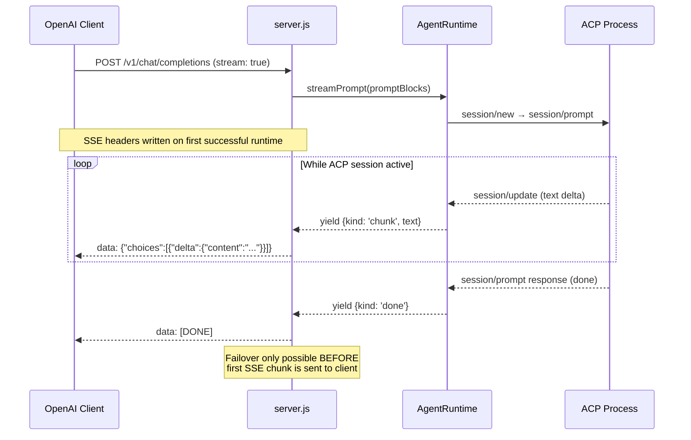

### 4.3  ACP session lifecycle

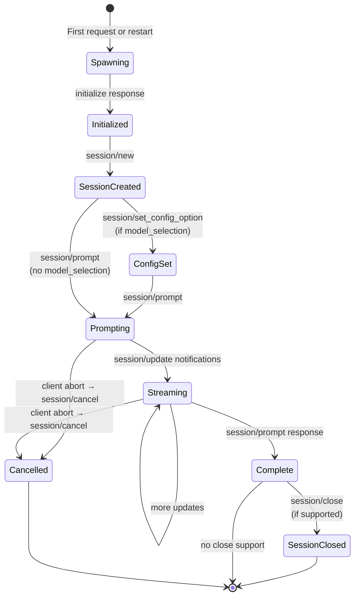


---

## 5  Routing and Failover

### 5.1  Strategy selection rationale

The default strategy is **`sticky_failover`**, not round-robin. Modern model APIs benefit from prompt/context cache locality — cache hits are tied to long matching prompt prefixes and often scoped to a provider account/route. Bouncing related requests across subprocesses loses both provider-side cache warmth and local ACP agent state.

Round-robin remains available when quota spreading or raw throughput matters more than cache locality.

### 5.2  Available strategies

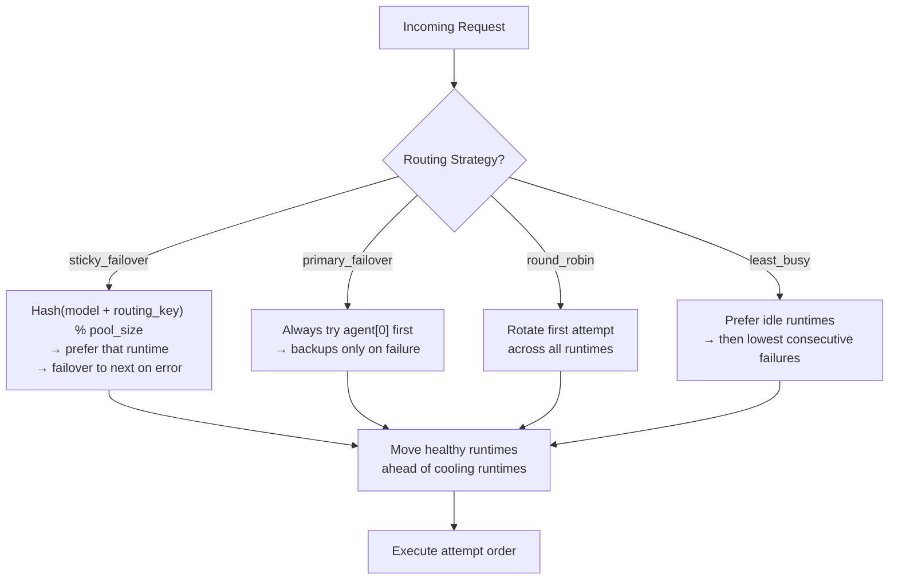

| Strategy | Behavior | Best for |
|----------|----------|----------|
| `sticky_failover` | Stable key/prefix hash → one runtime; next on retryable failure | Provider cache locality, repeated sessions |
| `primary_failover` | Always agent[0] first, backups on failure | Active/standby, one hot account |
| `round_robin` | Rotate first attempt across runtimes | Quota/load spreading |
| `least_busy` | Prefer idle runtimes | Local concurrent pools, latency-sensitive |

### 5.3  Sticky key derivation

The proxy resolves a routing key in priority order:

1. **Headers:** `X-ACP-Routing-Key`, `X-Routing-Key`, `X-Prompt-Cache-Key`, `OpenAI-Conversation-ID`
2. **Body fields:** `x_acp_routing_key`, `routing_key`, `prompt_cache_key`, `cache_key`, `user`, `session_id`, `conversation_id`, `thread_id`
3. **Metadata:** same field names inside `body.metadata`
4. **Fallback:** BLAKE2b-512 hash (truncated to 32 hex chars) of the first `affinity_prefix_chars` (default 4096) prompt characters
5. Body fields `session_id`, `conversation_id`, `thread_id` are used only for routing affinity; they are not forwarded to ACP.

### 5.4  Retry and failover

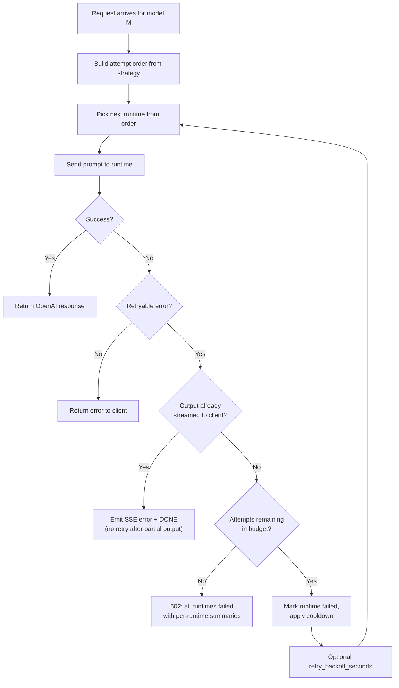

**Retry budget:**
- If `max_attempts_per_request > 0`, that is the hard cap.
- Otherwise: `max_attempts = pool_size × max_retries`.
- Example: 2 runtimes, `max_retries = 2` → attempts: `a, b, a, b` (4 total).

**Retryable error markers:** rate limit, quota exhausted, resource exhausted, account blocked/suspended, temporarily unavailable, overloaded, timeout, broken pipe, connection reset, process exit, JSON-RPC codes 408/409/423/425/429/500/502/503/504.

**Cooldown:** Failed runtimes are marked unhealthy for `failure_cooldown_seconds` (default 60). Healthy runtimes are preferred, but cooling runtimes are still attempted if all are cooling.

**Per-runtime health state** (`AgentRuntime` in `acpClient.js`):

| Field | Set by | Cleared by |
|-------|--------|------------|
| `cooldownUntil` (epoch ms) | `markFailure()` | `markSuccess()` (immediately) or expiry |
| `consecutiveFailures` | `markFailure()` | `markSuccess()` (reset to 0) |
| `lastError` / `lastFailureAt` | `markFailure()` | `markSuccess()` |

`inCooldown` is a live property: `Date.now() < cooldownUntil`. The `/health` endpoint exposes `cooldown_remaining_seconds`, `consecutive_failures`, `failure_count`, `success_count`, `last_error`, and `last_failure_at` per agent.

**`healthyFirst()` reordering** (`router.js`): called on every request, after the strategy-specific base order is computed. It partitions the pool into healthy (not in cooldown) and cooling runtimes, then returns `[...healthy, ...cooling]`. If all runtimes are cooling, the original order is preserved so the system degrades gracefully rather than refusing all requests.

**`QueueFullError` exception:** queue-full errors do NOT call `markFailure()` — a full queue means the runtime is busy, not broken, so no cooldown penalty is applied.

**Concrete scenario — quota exhausted on agent-1, two-runtime pool:**

1. **Request 1:** `healthyFirst` → both healthy → attempt order `[agent-1, agent-2]`. Agent-1 returns 429. `markFailure()` sets `cooldownUntil = now + 60 s`. Agent-2 tried next → succeeds.
2. **Request 2 (5 s later):** `healthyFirst` sees agent-1 still cooling → reorders to `[agent-2, agent-1]`. Agent-2 is tried **first** and succeeds; agent-1 is never contacted.
3. **Request 3 (70 s later):** agent-1's cooldown has expired → both healthy again → base sticky hash restores `[agent-1, agent-2]`. If agent-1 has recovered it serves normally; if it fails again it receives another cooldown window.

The proxy therefore "knows" about a failed agent through the in-memory `cooldownUntil` timestamp. The knowledge is lost on process restart.

**Streaming rule:** Failover is only safe before user-visible SSE content has been emitted. After partial output, retrying would duplicate text or agent side effects.


---

## 6  HTTP API Surface

### Endpoints

| Method | Path | Purpose |
|--------|------|---------|
| `GET` | `/health`, `/healthz` | Pool/runtime health with per-agent metrics |
| `GET` | `/v1/models` | OpenAI-style model list with pool extension metadata |
| `GET` | `/v1/models/{model}` | Single model detail |
| `POST` | `/v1/chat/completions` | Chat Completions (streaming and non-streaming) |
| `POST` | `/v1/completions` | Legacy Completions |
| `POST` | `/v1/responses` | Minimal Responses API |

### Response headers on generation

| Header | Value |
|--------|-------|
| `X-ACP-Agent` | Instance id of the selected ACP runtime |
| `X-ACP-Model` | Requested OpenAI-compatible model id |
| `X-ACP-Upstream-Model` | Upstream model the proxy set via `session/set_config_option` / `session/set_model` (only when model selection fired) |
| `X-Request-ID` | Correlation id; included in every log line for the request |

### Authentication

When `server.api_key` is configured, all `/v1/*` endpoints require `Authorization: Bearer <key>`. Health endpoints are unauthenticated — bind to `127.0.0.1` or use a reverse proxy for network security.

---

## 7  Protocol Translation

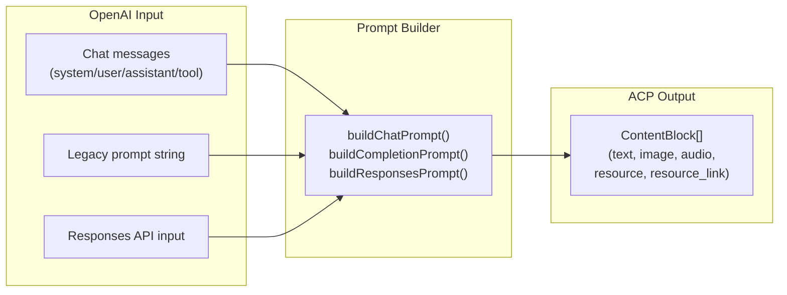

### 7.1  Chat message conversion

All input messages are flattened into ACP `ContentBlock` values. Text messages become a single ACP text block with labelled sections:

```
[system]
You are helpful.

[user]
Hello!

[assistant]
Hi there!
```

Prior assistant `tool_calls` and `tool_call_id` fields are preserved as plain text context. Client-owned function tools are injected as `[system(openai_client_tools)]` instructions.

### 7.2  Multimodal mapping

| OpenAI input | ACP block type | Capability gate |
|-------------|---------------|-----------------|
| Text | `text` | none |
| `data:image/...;base64,...` | `image` | `promptCapabilities.image` |
| Image URL / file URI | `resource_link` | none |
| `data:audio/...;base64,...` | `audio` | `promptCapabilities.audio` |
| Audio URL / file URI | `resource_link` | none |
| File URL / URI | `resource_link` | none |
| Inline file (text/base64/data URI) | `resource` | `promptCapabilities.embeddedContext` |

`file_id` is rejected (local ACP agents cannot dereference OpenAI-hosted files). Remote URLs are forwarded as links, never downloaded (avoids SSRF, credential leaks, size issues).

### 7.3  Client-side tools

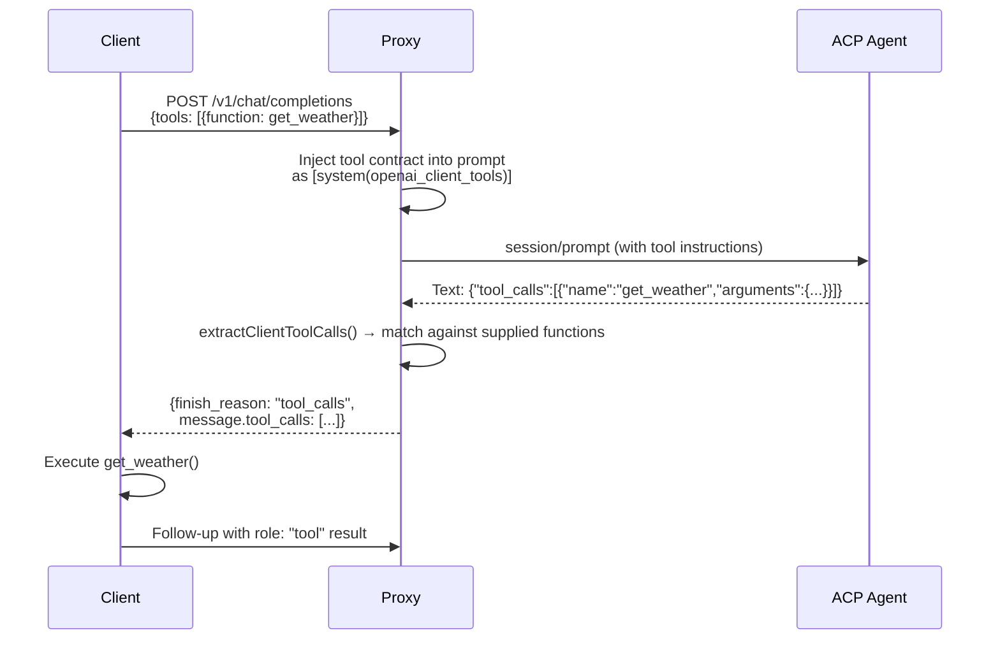

The proxy never executes client-owned tools. It injects the contract, detects structured JSON output from the agent, and translates it back to OpenAI `tool_calls`. Streaming with tools is buffered until the ACP turn completes.

### 7.4  ACP permission handling

| Mode | Behavior |
|------|----------|
| `deny` | Reject all permission requests (default) |
| `read_only` | Approve read/list/search operations; reject write/execute |
| `allow` | Auto-approve all (trusted sandboxes only) |

### 7.5  Usage accounting

ACP usage fields are mapped to OpenAI format (`prompt_tokens`, `completion_tokens`, `total_tokens`, `cached_tokens`, `reasoning_tokens`). When no usage data is available, tokens are estimated as `ceil(chars / 4)`.

---

## 8  Configuration

### 8.1  Top-level schema

```json
{
  "server": {
    "host": "127.0.0.1",
    "port": 11435,
    "api_key": "local-proxy-token",
    "routing_strategy": "sticky_failover",
    "max_retries": 1,
    "failure_cooldown_seconds": 60,
    "logging": { "level": "info", "format": "json" }
  },
  "agents": [
    {
      "name": "gemini",
      "instance_id": "gemini-a",
      "command": "npx",
      "args": ["-y", "@google/gemini-cli@latest", "--model", "auto", "--experimental-acp"],
      "models": ["gemini"],
      "env": { "GEMINI_API_KEY": "{var:GEMINI_API_KEY_A}" },
      "permission": "deny"
    }
  ]
}
```

JSON only. The old `env_sections` indirection is rejected.

### 8.2  Routing configuration

| Field | Default | Description |
|-------|---------|-------------|
| `routing_strategy` | `sticky_failover` | Pool routing algorithm |
| `max_retries` | `1` | Full-pool retry passes |
| `max_attempts_per_request` | `0` (auto) | Hard attempt cap; 0 = `pool_size × max_retries` |
| `failure_cooldown_seconds` | `60` | Unhealthy cooldown period |
| `retry_backoff_seconds` | `0` | Pause between retry attempts |
| `retry_on_any_acp_error` | `false` | Make all ACP errors retryable |
| `affinity_prefix_chars` | `4096` | Prompt prefix length for sticky key hash |
| `max_request_bytes` | `67108864` (64 MiB) | Maximum accepted request body size; returns 413 if exceeded |

### 8.3  Agent configuration

| Field | Description |
|-------|-------------|
| `name` | Logical agent name |
| `instance_id` | Unique runtime id (auto-derived if omitted) |
| `command`, `args`, `cwd` | Subprocess launch parameters |
| `models` | OpenAI model ids routed to this runtime |
| `env` | Per-agent environment variables with `{var:NAME}` / `${NAME}` / `{file:/path}` expansion |
| `model_selection` | Optional ACP session-config model mapping |
| `mcp_servers` | Passed to ACP `session/new` |
| `permission` | `deny` / `read_only` / `allow` |
| `expose_tool_updates` | Emit tool/progress/plan markers in output stream |
| `start_at_boot` | Pre-start on server launch |
| `startup_timeout_seconds` | Max wait for initialization (default 30) |
| `request_timeout_seconds` | Per-request timeout (inherited from server) |

### 8.4  Config reference expansion

```
{var:NAME}          {env:NAME}
{var:NAME:-fallback} {env:NAME:-fallback}
${NAME}             ${NAME:-fallback}      $NAME
{file:/absolute/path/to/secret}
```

Missing variables without a fallback expand to empty string.

`{file:...}` is supported in `agents[].env` values and `server.api_key`. It runs before environment expansion, reads UTF-8 secret files, strips one trailing `\n` or `\r\n`, supports `~/` and Windows-style `%VAR%` references inside the path, and requires the resolved path to be absolute. Relative file tokens are left unchanged. Missing or unreadable secret files fail config loading. Store secret files outside the repository and restrict permissions, for example `0600`.

### 8.5  Model selection via ACP session config

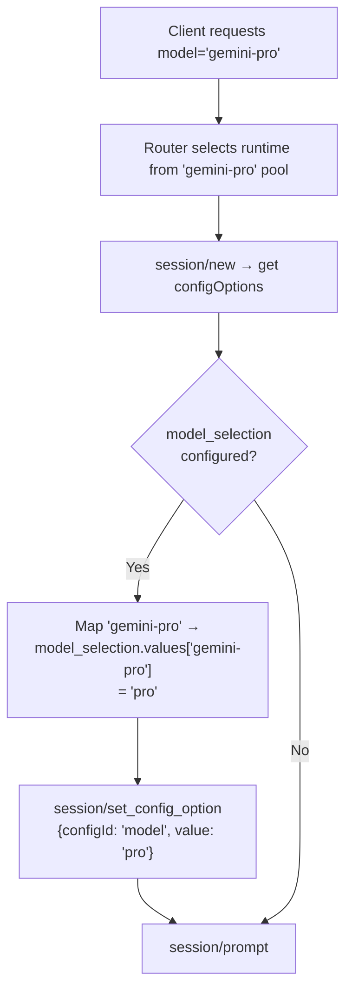


---

## 9  Process Lifecycle

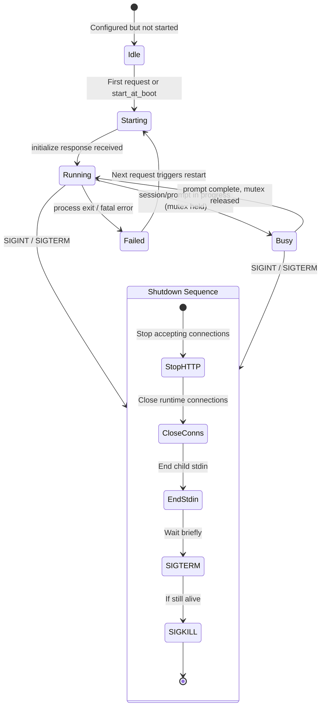

Each `AgentRuntime` serializes prompt turns with an in-memory mutex — many ACP CLIs are single-interaction processes even when long-lived. Runtimes start lazily on first request unless `start_at_boot = true`.

---

## 10  Error Model

All HTTP errors follow the OpenAI error shape:

```json
{
  "error": {
    "message": "...",
    "type": "acp_error",
    "param": null,
    "code": null
  }
}
```

| Status | Meaning |
|--------|---------|
| 400 | Invalid request, unsupported capability, or capability failure across all candidates |
| 401 | Missing or invalid bearer token |
| 404 | Unknown model or path |
| 502 | ACP runtime failure (all runtimes exhausted) |

When all runtimes fail, the error message includes per-runtime failure summaries.

---

## 11  Deployment

### 11.1  Local

```bash
node src/index.js --config config.json
```

Runtime: Node.js 20+. Zero npm dependencies. Uses `node:http`, `node:child_process`, `node:crypto`, `node:fs`, `node:path`.

### 11.2  Docker

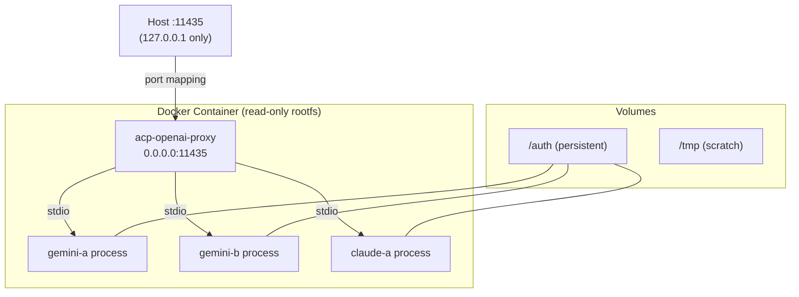

Security posture: non-root user, read-only root filesystem, no added Linux capabilities, `no-new-privileges`, private `/tmp`. Published port bound to `127.0.0.1`.

Agent CLIs are installed at image build time (no `npx` fetches at runtime). The `/auth` volume persists CLI state across container restarts. Each agent uses a subdirectory (`GEMINI_CLI_HOME`, `HOME`) for isolation.

### 11.3  Supported ACP agents

| Agent | Command | Notes |
|-------|---------|-------|
| Gemini CLI | `gemini --model auto --experimental-acp` | Default in Docker image |
| Claude ACP | `claude-agent-acp` | Default in Docker image |
| GitHub Copilot | `copilot --acp --stdio --model gpt-5-mini` | Default in Docker image |
| Qwen Code | `npx @qwen-code/qwen-code@latest --acp` | Add to image as needed |
| Auggie CLI | `npx @augmentcode/auggie@latest --acp` | Add to image as needed |
| Codex CLI | `npx @zed-industries/codex-acp@latest` | Add to image as needed |
| OpenCode | `npx opencode-ai@latest acp` | Add to image as needed |
| Kilo Code | `npx --yes --package @kilocode/cli@latest kilo acp` | Add to image as needed |

---

## 12  Design Decisions Log

### Why `sticky_failover` over round-robin as default

Round-robin splits related requests across independent accounts/processes, reducing provider-side cache reuse and forcing each process to rebuild local state. `sticky_failover` keeps stable workspaces/users/conversations on the same runtime while still handling quota exhaustion, rate limits, account blocks, and process exits via failover.

Round-robin remains appropriate when quota spreading is the explicit goal or when cache savings are negligible.

### Why raw JSON-RPC over stdio instead of the ACP SDK

Keeps the proxy dependency-light (zero npm runtime dependencies) while remaining compatible with any Node-hosted ACP agent. The official TypeScript ACP SDK can be adopted later if richer typed features are needed.

### Why client tools are prompt-injected, not executed

The proxy is a translation layer, not a tool runtime. Client-owned tools are the HTTP client's responsibility. The proxy injects the tool contract into the ACP prompt, detects structured JSON tool-call responses, and translates them back to OpenAI format. This avoids trust, sandboxing, and side-effect concerns inside the proxy.

### Why no remote URL downloading

Forwarding URLs as `resource_link` blocks avoids SSRF, hidden credential forwarding, cache invalidation complexity, and unbounded download sizes. The ACP agent decides whether and how to fetch resources.

### What was changed from the original spec

- Default routing changed from round-robin to `sticky_failover` for cache locality.
- Route observability added (`X-ACP-Agent`, `X-ACP-Model`, `/health` metrics, `/v1/models` extensions).
- Retry attempts bounded by `max_retries` (full-pool passes) or `max_attempts_per_request` (hard cap).
- Streaming failover limited to the pre-output phase.
- `env_sections` indirection removed in favor of direct per-agent `env` blocks.

### What was intentionally not built

Persistent session database, remote file downloader, provider plugin registry, proxy-side tool execution, dashboard/metrics stack, queue broker, distributed scheduler, complex TTL pool manager. These would obscure the core proxy and increase operational risk.

---

## 13  Verification

```bash
npm run check   # Syntax check all source files
npm test         # Run integration tests (44 passing)
```

Tests cover: logger stdout/stderr routing, logger text format, config logging normalization, env expansion and rejected env_sections, model_selection mapping, round-robin pool with duplicate model ids, primary-failover retry on quota-like failures, all-runtimes-failed 502, sticky_failover affinity, multimodal data URI, OpenAI client-tool envelope, streaming tool-call deltas, streaming SSE chunks + DONE + usage, streaming usage on a separate choices:[] chunk, image capability gating, model_selection required:false fallback, max_request_bytes 413, conversation_id routing affinity, /v1/responses non-streaming multimodal.
